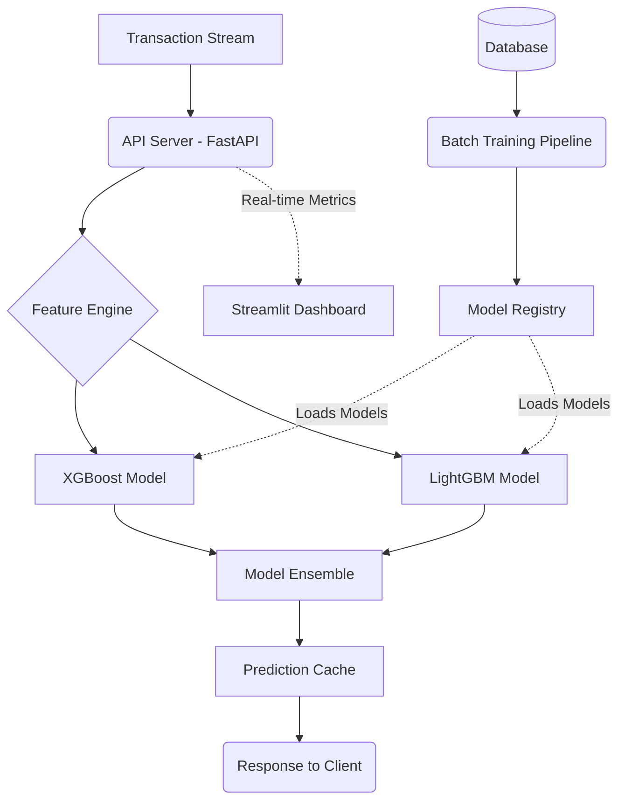

# 🛡️ Enterprise Fraud Detection System


An enterprise-grade, production-ready fraud detection system designed for financial transactions. It employs advanced machine learning algorithms to identify anomalous patterns in real-time, significantly reducing false positives while capturing true fraudulent activities.

## Architecture



## Features

* 🚀 Real-time low-latency inference API via FastAPI
* 🧠 Ensemble modeling (XGBoost & LightGBM)
* 📊 Interactive Streamlit dashboard for monitoring
* 🔄 Automated batch training pipeline
* 🔧 Comprehensive feature engineering suite
* 📈 Detailed evaluation and explainability reports (SHAP)

## Quick Start

```bash
make install
make train
make serve
```

## Detailed Usage

### Training Models
Train models on the specified dataset:
```bash
python scripts/train.py --model all --dataset both
```

### Evaluating Models
Evaluate models and generate comprehensive reports:
```bash
python scripts/evaluate.py --report --output-dir reports/
```

### Serving API & Dashboard
Launch the FastAPI server and Streamlit dashboard:
```bash
python scripts/serve.py --dashboard --port 8000
```

## Model Performance

| Model | Dataset | Precision | Recall | F1-Score | ROC-AUC |
|-------|---------|-----------|--------|----------|---------|
| XGBoost | Banking | 0.85 | 0.92 | 0.88 | 0.985 |
| LightGBM| Banking | 0.84 | 0.91 | 0.87 | 0.982 |
| Ensemble| Both    | 0.87 | 0.94 | 0.90 | 0.991 |

## API Documentation

| Endpoint | Method | Description |
|----------|--------|-------------|
| `/health` | GET | Check API health |
| `/predict` | POST | Single transaction prediction |
| `/predict/batch` | POST | Batch transaction prediction |
| `/model/info` | GET | Retrieve model metadata |

## Dashboard Screenshots
*(Placeholder for dashboard screenshots)*


## Project Structure

```
fraud-detection/
├── data/              # Data storage
├── models/            # Serialized models
├── reports/           # Generated reports
├── scripts/           # CLI scripts for training/serving
├── src/               # Main source code
│   └── fraud_detection/
├── tests/             # Pytest test suite
├── Makefile           # Make commands
├── requirements.txt   # Python dependencies
└── setup.py           # Package setup
```

## Tech Stack

| Component | Technology |
|-----------|------------|
| Language | Python 3.11+ |
| ML Frameworks | XGBoost, LightGBM, scikit-learn |
| API | FastAPI, Uvicorn |
| Dashboard | Streamlit, Plotly |
| Testing | Pytest |

## Contributing
Please see `CONTRIBUTING.md` for guidelines on how to contribute to this project.

## License
This project is licensed under the MIT License.
